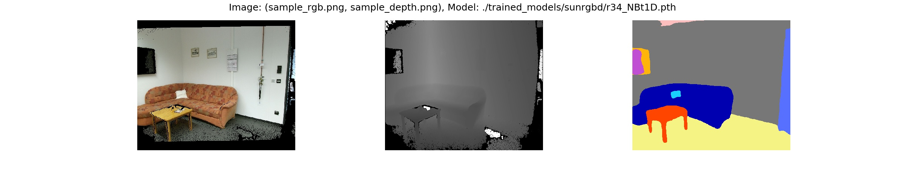
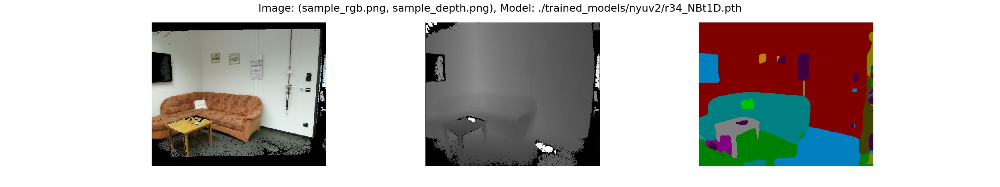

# ESANet: Efficient RGB-D Semantic Segmentation for Indoor Scene Analysis

> 🔥 2025-12-18: updated to keep it working in 2025+ (see full changelog below)

> 🔥 You may also want to have a look at our follow-up works:  
• [EMSANet](https://github.com/TUI-NICR/EMSANet) [IJCNN 2022] and [EMSFormer](https://github.com/TUI-NICR/EMSFormer) [IJCNN 2023] – multi-task approach, better results for semantic segmentation, and cleaner and more extendable code base  
• [DVEFormer](https://github.com/TUI-NICR/DVEFormer) [IROS 2025] – efficient prediction of dense visual embeddings instead of fixed semantic classes for scene enhanced understanding  
• [SemanticNDT](https://github.com/TUI-NICR/semantic-mapping) [ICRA 2022] and [PanopticNDT](https://github.com/TUI-NICR/panoptic-mapping) [IROS 2023] – downstream application for semantic/panoptic mapping.

This repository contains the code to our paper "Efficient RGB-D Semantic 
Segmentation for Indoor Scene Analysis" ([IEEE Xplore](https://ieeexplore.ieee.org/document/9561675),  [arXiv](https://arxiv.org/pdf/2011.06961.pdf)).

Our carefully designed network architecture enables real-time semantic 
segmentation on a NVIDIA Jetson AGX Xavier and, thus, is well suited as a 
common initial processing step in a complex system for real-time scene 
analysis on mobile robots:

<div align="center">
      <a href="https://youtu.be/-Sopja6UEJg"></a>
      <br>(Click on the image to open Youtube Video)
      <br><br>
</div>

Our approach can also be applied to outdoor scenarios such as Cityscapes:

<div align="center">
      <a href="https://youtu.be/XbFTGwFyl4Y"></a>
      <br>(Click on the image to open Youtube Video)
      <br><br>
</div>

This repository contains the code for training, evaluating our networks. 
Furthermore, we provide code for converting the model to ONNX and TensorRT, 
as well as for measuring the inference time. 

## License and Citations
The source code is published under Apache 2.0 license, see [license file](LICENSE) for details. 

If you use the source code or the network weights, please cite the following paper:
> Seichter, D., Köhler, M., Lewandowski, B., Wengefeld T., Gross, H.-M.
*Efficient RGB-D Semantic Segmentation for Indoor Scene Analysis*
in IEEE International Conference on Robotics and Automation (ICRA), pp. 13525-13531, 2021.

<details>
<summary>BibTeX</summary>

```bibtex
@inproceedings{esanet2021icra,
  title     = {Efficient RGB-D Semantic Segmentation for Indoor Scene Analysis},
  author    = {Seichter, Daniel and K{\"o}hler, Mona and Lewandowski, Benjamin and Wengefeld, Tim and Gross, Horst-Michael},
  booktitle = {IEEE International Conference on Robotics and Automation (ICRA)},
  year      = {2021},
  volume    = {},
  number    = {},
  pages     = {13525-13531}
}

@article{esanet2020arXiv,
  title     = {Efficient RGB-D Semantic Segmentation for Indoor Scene Analysis},
  author    = {Seichter, Daniel and K{\"o}hler, Mona and Lewandowski, Benjamin and Wengefeld, Tim and Gross, Horst-Michael},
  journal   = {arXiv preprint arXiv:2011.06961},
  year      = {2020}
}
```

Note that the preprint was accepted to be published in IEEE International Conference on 
Robotics and Automation (ICRA).

</details>

This work is also embedded in a broader research framework that is described in the corresponding PhD thesis:

> Seichter, D. *Szenen- und Umgebungsanalyse in der mobilen Assistenzrobotik*, Ilmenau, Germany, 2025,
  DOI: [10.22032/dbt.64081](https://doi.org/10.22032/dbt.64081).

The dissertation is written in German, but it can certainly be translated automatically. 😉

<details>
<summary>BibTeX</summary>

```bibtex
@phdthesis{seichter2025phd,
  author    = {Seichter, Daniel},
  title     = {Szenen- und Umgebungsanalyse in der mobilen Assistenzrobotik},
  year      = {2025},
  note      = {Dissertation, Technische Universit{\"a}t Ilmenau, 2024},
  doi       = {10.22032/dbt.64081},
  url       = {https://doi.org/10.22032/dbt.64081},
  language  = {de}
}
```

</details>

## Setup

1. Clone repository:
    ```bash
    git clone https://github.com/TUI-NICR/ESANet.git
   
    cd /path/to/this/repository
    ```

2. Set up anaconda environment including all dependencies:  
    Updated environment from 2025 (Python 3.12, PyTorch 2.9.1, no TensorFlow and PyTorch Ignite anymore):
    ```bash
    conda env create -f env_esanet2025_mac.yaml  # macos with mps
    conda env create -f env_esanet2025.yaml   # linux with cuda

    conda activate esanet2025
    ```
    
    Create your own conda environment:
    ```bash
    conda create --name "esanet2025" python=3.12
    conda activate esanet2025

    python -m pip install opencv-python matplotlib pandas tqdm
    python -m pip install torch torchvision
    python -m pip install cityscapesScripts
    ```

    Original environment from paper - go back to
    [49d2201](https://github.com/TUI-NICR/ESANet/commit/49d220196f3d27a7949772d543111694b9ca3b16) and run:
   
    ```bash
    conda env create -f rgbd_segmentation.yaml

    conda activate rgbd_segmentation
    ```

4. Data preparation (training / evaluation / dataset inference):  
    We trained our networks on 
    [NYUv2](https://cs.nyu.edu/~silberman/datasets/nyu_depth_v2.html), 
    [SUNRGB-D](https://rgbd.cs.princeton.edu/), and 
    [Cityscapes](https://www.cityscapes-dataset.com/). 
    The encoders were pretrained on [ImageNet](http://www.image-net.org/challenges/LSVRC/2012/downloads).
    Furthermore, we also pretrained our best model on the synthetic dataset 
    [SceneNet RGB-D](https://robotvault.bitbucket.io/scenenet-rgbd.html). 

    The folder [`src/datasets`](src/datasets) contains the code to prepare
    NYUv2, SunRGB-D, Cityscapes, SceneNet RGB-D for training and evaluation. 
    Please follow the instructions given for the respective dataset and store 
    the created datasets in `./datasets`.
    For ImageNet, we used [TensorFlowDatasets](https://www.tensorflow.org/datasets/catalog/imagenet2012) (see `imagenet_pretraining.py`).

5. Pretrained models (evaluation):  
    We provide the weights for our selected ESANet-R34-NBt1D (with ResNet34 NBt1D backbones) on NYUv2, SunRGBD, and Cityscapes:
   
    | Dataset                 | Model                            | mIoU  | FPS*     | URL  |
    |-------------------------|----------------------------------|-------|----------|------|
    | NYUv2 (test)            | ESANet-R34-NBt1D                 | 50.30 | 29.7     | [Download](https://drive.google.com/uc?id=1C5-kJv4w3foicEudP3DAjdIXVuzUK7O8) |
    |                         | ESANet-R34-NBt1D (pre. SceneNet) | 51.58 | 29.7     | [Download](https://drive.google.com/uc?id=1w_Qa8AWUC6uHzQamwu-PAqA7P00hgl8w) |
    | SUNRGB-D (test)         | ESANet-R34-NBt1D                 | 48.17 | 29.7**   | [Download](https://drive.google.com/uc?id=1tviMAEOr-6lJphpluGvdhBDA_FetIR14) |
    |                         | ESANet-R34-NBt1D (pre. SceneNet) | 48.04 | 29.7**   | [Download](https://drive.google.com/uc?id=1ukKafozmAcr8fQLbVvTtioKPLwTu0XZO) |
    | Cityscapes (valid half) | ESANet-R34-NBt1D                 | 75.22 | 23.4     | [Download](https://drive.google.com/uc?id=1xal13D_lXYVlfJx_NBiPTvuf4Ijn7wrt) |
    | Cityscapes (valid full) | ESANet-R34-NBt1D                 | 80.09 | 6.2      | [Download](https://drive.google.com/uc?id=18eKh2XD9fwdYCUM4MuCYxH7jNucIYk8O) |
   
    Download and extract the models to `./trained_models`, or use the following commands:

    ```bash
    python -m pip install gdown  # tested: gdown 5.2.0
    cd ./trained_models

    # NYUv2
    gdown 1C5-kJv4w3foicEudP3DAjdIXVuzUK7O8  # nyuv2_r34_NBt1D.tar.gz
    gdown 1w_Qa8AWUC6uHzQamwu-PAqA7P00hgl8w  # nyuv2_r34_NBt1D_scenenet.tar.gz

    # SUNRGB-D
    gdown 1tviMAEOr-6lJphpluGvdhBDA_FetIR14  # sunrgbd_r34_NBt1D.tar.gz
    gdown 1ukKafozmAcr8fQLbVvTtioKPLwTu0XZO  # sunrgbd_r34_NBt1D_scenenet.tar.gz

    # Cityscapes
    gdown 1xal13D_lXYVlfJx_NBiPTvuf4Ijn7wrt  # cityscapes_r34_NBt1D_half.tar.gz
    gdown 18eKh2XD9fwdYCUM4MuCYxH7jNucIYk8O  # cityscapes_r34_NBt1D_full.tar.gz

    # extract
    find . -name "*.tar.gz" -exec tar -xvzf {} \;
    ```

   *We report the FPS for NVIDIA Jetson AGX Xavier (Jetpack 4.4, TensorRT 7.1, Float16).   
   **Note that we only reported the inference time for NYUv2 in our paper as it has more classes than SUNRGB-D. 
   Thus, the FPS for SUNRGB-D can be slightly higher (37 vs. 40 classes).  

## Changelog
2025-12-18 (first major update since 2021):
- replace implementation for mIoU metric with pure PyTorch version to avoid 
  dependencies on TensorFlow or PyTorch Ignite
- updated conda environment (Python 3.12 and PyTorch 2.9.1 -> env_esanet2025.yaml)
- add support for macOS with MPS backend (Python 3.12 and 
  PyTorch 2.9.1 -> env_esanet2025_mac.yaml)
- fix lambda pickling issues when using multiple workers in DataLoader
- force that RandomCrop to always returns a contiguous array
- fix issues with RandomHSV augmentation (wrong range for value channel)
  -> might slightly affect training results
- minor dataset preparation instruction updates
- add arguments `--toolbox_filepath` and `--data_filepath` to SUNRGB-D 
  preparation script to enable reusing already downloaded toolbox and data files
- switch to Apache 2.0 license 
- add note to corresponding PhD thesis

Note: Updates do not include inference on the Jetson. See the corresponding PhD thesis for more recent timing results.

## Content
There are subsection for different things to do:
- [Evaluation](#evaluation): Reproduce results reported in our paper.
- [Dataset Inference](#dataset-inference): Apply trained model to samples from dataset.
- [Sample Inference](#sample-inference): Apply trained model to samples in [`./samples`](samples).
- [Time Inference](#time-inference): Time inference on NVIDIA Jetson AGX Xavier using TensorRT.
- [Training](#training): Train new ESANet model.

## Evaluation
To reproduce the mIoUs reported in our paper, use `eval.py`.

> Note that building the model correctly depends on the respective dataset the 
model was trained on. Passing no additional model arguments to `eval.py` 
defaults to evaluating our ESANet-R34-NBt1D either on NYUv2 or SUNRGB-D. 
For Cityscapes the parameters differ. You will find a `argsv_*.txt` file next 
to the network weights listing the required arguments.

Examples: 
- To evaluate our ESANet-R34-NBt1D trained on NYUv2, run:
    ```bash
    python eval.py \
        --dataset nyuv2 \
        --dataset_dir ./datasets/nyuv2 \
        --ckpt_path ./trained_models/nyuv2/r34_NBt1D.pth
     
    # Camera: kv1 mIoU: 50.30
    # All Cameras, mIoU: 50.30
    ```
- To evaluate our ESANet-R34-NBt1D trained on SUNRGB-D, run:
    ```bash
    python eval.py \
        --dataset sunrgbd \
        --dataset_dir ./datasets/sunrgbd \
        --ckpt_path ./trained_models/sunrgbd/r34_NBt1D.pth
    
    # Camera: realsense mIoU: 32.42
    # Camera: kv2 mIoU: 46.28
    # Camera: kv1 mIoU: 53.39
    # Camera: xtion mIoU: 41.93
    # All Cameras, mIoU: 48.17
    ```
  
- To evaluate our ESANet-R34-NBt1D trained on Cityscapes, run:
    ```bash
    # half resolution (1024x512)
    python eval.py \
        --dataset cityscapes-with-depth \
        --dataset_dir ./datasets/cityscapes \
        --ckpt_path ./trained_models/cityscapes/r34_NBt1D_half.pth \
        --height 512 \
        --width 1024 \
        --raw_depth \
        --context_module appm-1-2-4-8
   
    # Camera: camera1 mIoU: 75.22
    # All Cameras, mIoU: 75.22  
  
  
    # full resolution (2048x1024)
    # note that the model is created and was trained on half resolution, only
    # the evalution is done using full resolution  
    python eval.py \
        --dataset cityscapes-with-depth \
        --dataset_dir ./datasets/cityscapes \
        --ckpt_path ./trained_models/cityscapes/r34_NBt1D_full.pth \
        --height 512 \
        --width 1024 \
        --raw_depth \
        --context_module appm-1-2-4-8 \
        --valid_full_res
  
    # Camera: camera1 mIoU: 80.09
    # All Cameras, mIoU: 80.09
    ```


## Inference
We provide scripts for inference on both sample input images 
(`inference_samples.py`) and samples drawn from one of our used datasets 
(`inference_dataset.py`). 

> Note that building the model correctly depends on the respective dataset the 
model was trained on. Passing no additional model arguments to `eval.py` 
defaults to evaluating our ESANet-R34-NBt1D either on NYUv2 or SUNRGB-D. 
For Cityscapes the parameters differ. You will find a `argsv_*.txt` file next 
to the network weights listing the required arguments for Cityscapes. 

### Dataset Inference
Use `inference_dataset.py` to apply a trained model to samples drawn from one of 
our used datasets:

Example: To apply ESANet-R34-NBt1D trained on SUNRGB-D to samples from SUNRGB-D, 
run:
```bash
# note that the entire first batch is visualized, so larger batch sizes results 
# in smaller images in the plot
python inference_dataset.py \
    --dataset sunrgbd \
    --dataset_dir ./datasets/sunrgbd \
    --ckpt_path ./trained_models/sunrgbd/r34_NBt1D_scenenet.pth \
    --batch_size 4
```

### Sample Inference
Use `inference_samples.py` to apply a trained model to the samples given in 
`./samples`.

> Note that the dataset argument is required to determine the correct 
preprocessing and the class colors. However, you do not need to prepare the 
respective dataset. Furthermore, depending on the given depth images and the 
used dataset for training, an additional depth scaling might be necessary.

Examples: 
- To apply our ESANet-R34-NBt1D trained on SUNRGB-D to the samples, run:
    ```bash
    python inference_samples.py \
        --dataset sunrgbd \
        --ckpt_path ./trained_models/sunrgbd/r34_NBt1D.pth \
        --depth_scale 1 \
        --raw_depth
    ```
    
  
- To apply our ESANet-R34-NBt1D trained on NYUv2 to the samples, run:
    ```bash
    python inference_samples.py \
        --dataset nyuv2 \
        --ckpt_path ./trained_models/nyuv2/r34_NBt1D.pth \
        --depth_scale 0.1 \
        --raw_depth
    ```
    

### Time Inference
We timed the inference on a NVIDIA Jetson AGX Xavier with Jetpack 4.4 
(TensorRT 7.1.3, PyTorch 1.4.0).

Reproducing the timings on a NVIDIA Jetson AGX Xavier with Jetpack 4.4 further 
requires:
- [the PyTorch 1.4.0 wheel](https://nvidia.box.com/shared/static/ncgzus5o23uck9i5oth2n8n06k340l6k.whl) from [NVIDIA Forum](https://forums.developer.nvidia.com/t/pytorch-for-jetson-version-1-7-0-now-available/72048)
- [the NVIDIA TensorRT Open Source Software](https://github.com/NVIDIA/TensorRT/releases/tag/7.1.3) (`onnx2trt` is used to convert the onnx model to a TensorRT engine) 
- the requirements listed in `requirements_jetson.txt`:
    ```bash
    pip3 install -r requirements_jetson.txt --user
    ```

Subsequently, you can run `inference_time.sh` to reproduce the reported timings 
for ESANet.

The inference time of a single model can be computed with 
`inference_time_whole_model.py`.

Example: To reproduce the timings of our ESANet-R34-NBt1D trained on NYUv2, run:
```bash
python3 inference_time_whole_model.py \
    --dataset nyuv2 \
    --no_time_pytorch \
    --no_time_onnxruntime \
    --trt_floatx 16
``` 
> Note that a Jetpack version earlier than 4.4 fails completely or results in 
deviating outputs due to differently handled upsampling.

To reproduce the timings of other models we compared in our paper to, follow the 
instructions given in [src/models/external_code](src/models/external_code).

### Training
Use `train.py` to train ESANet on NYUv2, SUNRGB-D, Cityscapes, or SceneNet RGB-D
(or implement your own dataset by following the implementation of the provided 
datasets).
The arguments default to training ESANet-R34-NBt1D on NYUv2 with the 
hyper-parameters from our paper. Thus, they could be omitted but are presented 
here for clarity.

> Note that training ESANet-R34-NBt1D requires the pretrained weights for the 
encoder backbone ResNet-34 NBt1D. You can download our pretrained weights on 
ImageNet from [Link](https://drive.google.com/uc?id=1neUb6SJ87dIY1VvrSGxurVBQlH8Pd_Bi). 
Otherwise, you can use `imagenet_pretraining.py` to create your own pretrained weights.

```bash
python -m pip install gdown  # tested: gdown 5.2.0
cd ./trained_models

# ImageNet pretrained weights
gdown 1neUb6SJ87dIY1VvrSGxurVBQlH8Pd_Bi  # imagenet_r34_NBt1D.tar.gz
tar -xvzf imagenet_r34_NBt1D.tar.gz
```

Examples: 
- Train our ESANet-R34-NBt1D on NYUv2 (except for the dataset arguments, also 
valid for SUNRGB-D):
    ```bash
    # either specify all arguments yourself
    python train.py \
        --dataset nyuv2 \
        --dataset_dir ./datasets/nyuv2 \
        --pretrained_dir ./trained_models/imagenet \
        --results_dir ./results \
        --height 480 \
        --width 640 \
        --batch_size 8 \
        --batch_size_valid 24 \
        --lr 0.01 \
        --optimizer SGD \
        --class_weighting median_frequency \
        --encoder resnet34 \
        --encoder_block NonBottleneck1D \
        --nr_decoder_blocks 3 \
        --modality rgbd \
        --encoder_decoder_fusion add \
        --context_module ppm \
        --decoder_channels_mode decreasing \
        --fuse_depth_in_rgb_encoder SE-add \
        --upsampling learned-3x3-zeropad
    
    # or use the default arguments
    python train.py \
        --dataset nyuv2 \
        --dataset_dir ./datasets/nyuv2 \
        --pretrained_dir ./trained_models/imagenet \
        --results_dir ./results
    ```

- Train our ESANet-R34-NBt1D on Cityscapes:
    ```bash
    # note that the some parameters are different
    python train.py \
        --dataset cityscapes-with-depth \
        --dataset_dir ./datasets/cityscapes \
        --pretrained_dir ./trained_models/imagenet \
        --results_dir ./results \
        --raw_depth \
        --he_init \
        --aug_scale_min 0.5 \
        --aug_scale_max 2.0 \
        --valid_full_res \
        --height 512 \
        --width 1024 \
        --batch_size 8 \
        --batch_size_valid 16 \
        --lr 1e-4 \
        --optimizer Adam \
        --class_weighting None \
        --encoder resnet34 \
        --encoder_block NonBottleneck1D \
        --nr_decoder_blocks 3 \
        --modality rgbd \
        --encoder_decoder_fusion add \
        --context_module appm-1-2-4-8 \
        --decoder_channels_mode decreasing \
        --fuse_depth_in_rgb_encoder SE-add \
        --upsampling learned-3x3-zeropad
    ```

For further information, use `python train.py --help` or take a look at 
`src/args.py`.

> To analyze the model structure, use `model_to_onnx.py` with the same 
arguments to export an ONNX model file, which can be nicely visualized using 
[Netron](https://github.com/lutzroeder/netron).
